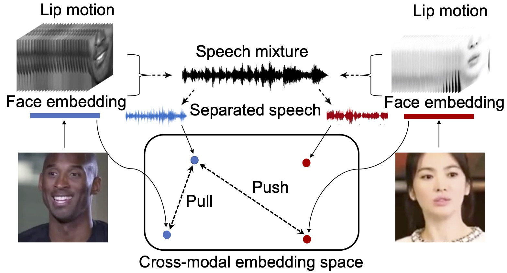

## VisualVoice: Audio-Visual Speech Separation with Cross-Modal Consistency
This repository contains the code for [VisualVoice](https://arxiv.org/pdf/2101.03149.pdf). [[Project Page]](http://vision.cs.utexas.edu/projects/VisualVoice/)



<br/>

[VisualVoice: Audio-Visual Speech Separation with Cross-Modal Consistency](https://arxiv.org/pdf/2101.03149.pdf)  
 [Ruohan Gao](https://www.cs.utexas.edu/~rhgao/)<sup>1,2</sup> and [Kristen Grauman](http://www.cs.utexas.edu/~grauman/)<sup>1,2</sup> <br/>
 <sup>1</sup>UT Austin, <sup>2</sup>Facebook AI Research  
In arXiv, 2021  
 
<br/>

If you find our data or project useful in your research, please cite:

    @article{gao2021VisualVoice,
      title={VisualVoice: Audio-Visual Speech Separation with Cross-Modal Consistency},
      author={Gao, Ruohan and Grauman, Kristen},
        journal={arXiv preprint arXiv:2101.03149},
        year = {2021}
    }


### Demo with the pre-trained models
1. Download the pre-trained models:
```
wget http://dl.fbaipublicfiles.com/VisualVoice/av-speech-separation-model/facial_best.pth
wget http://dl.fbaipublicfiles.com/VisualVoice/av-speech-separation-model/lipreading_best.pth
wget http://dl.fbaipublicfiles.com/VisualVoice/av-speech-separation-model/unet_best.pth
wget http://dl.fbaipublicfiles.com/VisualVoice/av-speech-separation-model/vocal_best.pth
```

2. Preprocess the demo video using the following commands that convert the video to 25f/s, resample the audio to 16kHz, and track the speakers with a simple implementation based on a face detector. Using other advanced face tracker of your choice can lead to better separation results.
```
ffmpeg -i ./test_videos/interview.mp4 -filter:v fps=fps=25 ./test_videos/interview25fps.mp4
mv ./test_videos/interview25fps.mp4 ./test_videos/interview.mp4
python ./utils/detectFaces.py --video_input_path ./test_videos/interview.mp4 --output_path ./test_videos/interview/ --number_of_speakers 2 --scalar_face_detection 1.5 --detect_every_N_frame 8
ffmpeg -i ./test_videos/interview.mp4 -vn -ar 16000 -ac 1 -ab 192k -f wav ./test_videos/interview/interview.wav
python ./utils/crop_mouth_from_video.py --video-direc ./test_videos/interview/faces/ --landmark-direc ./test_videos/interview/landmark/ --save-direc ./test_videos/interview/mouthroi/ --convert-gray --filename-path ./test_videos/interview/filename_input/interview.csv
./
```

3. Use the downloaded pre-trained models to test on the demo video.
```
python testRealVideo.py \
--mouthroi_root ./test_videos/interview/mouthroi/ \
--facetrack_root ./test_videos/interview/faces/ \
--audio_path ./test_videos/interview/interview.wav \
--weights_lipreadingnet pretrained_models/lipreading_best.pth \
--weights_facial pretrained_models/facial_best.pth \
--weights_unet pretrained_models/unet_best.pth \
--weights_vocal pretrained_models/vocal_best.pth \
--lipreading_config_path configs/lrw_snv1x_tcn2x.json \
--num_frames 64 \
--audio_length 2.55 \
--hop_size 160 \
--window_size 400 \
--n_fft 512 \
--unet_output_nc 2 \
--normalization \
--visual_feature_type both \
--identity_feature_dim 128 \
--audioVisual_feature_dim 1152 \
--visual_pool maxpool \
--audio_pool maxpool \
--compression_type none \
--reliable_face \
--audio_normalization \
--desired_rms 0.7 \
--number_of_speakers 2 \
--mask_clip_threshold 5 \
--hop_length 2.55 \
--lipreading_extract_feature \
--number_of_identity_frames 1 \
--output_dir_root ./test_videos/interview/
```

### Dataset preparation for VoxCeleb2
1. Download the [VoxCeleb2](https://www.robots.ox.ac.uk/~vgg/data/voxceleb/vox2.html) dataset. The pre-processed mouth ROIs can be downloaded as follows:
```
# mounth ROIs for VoxCeleb2 (train: 1T; val: 20G; seen_heard_test: 88G; unseen_unheard_test: 20G)
wget http://dl.fbaipublicfiles.com/VisualVoice/mouth_roi_train.tar.gz
wget http://dl.fbaipublicfiles.com/VisualVoice/mouth_roi_val.tar.gz
wget http://dl.fbaipublicfiles.com/VisualVoice/mouth_roi_seen_heard_test.tar.gz
wget http://dl.fbaipublicfiles.com/VisualVoice/mouth_roi_unseen_unheard_test.tar.gz

# Directory structure of the dataset:
#    ├── VoxCeleb2                          
#    │       └── [mp4]               (contain the face tracks in .mp4)
#    │                └── [train]
#    │                └── [val]
#    │                └── [seen_heard_test]
#    │                └── [unseen_unheard_test]
#    │       └── [audio]             (contain the audio files in .wav)
#    │                └── [train]
#    │                └── [val]
#    │                └── [seen_heard_test]
#    │                └── [unseen_unheard_test]
#    │       └── [mouth_roi]         (contain the mouth ROIs in .h5)
#    │                └── [train]
#    │                └── [val]
#    │                └── [seen_heard_test]
#    │                └── [unseen_unheard_test]
```

2. Download the hdf5 files that contain the data paths, and then modify the hdf5 file accordingly by changing the paths to have the correct root prefix of your own.
```
wget http://dl.fbaipublicfiles.com/VisualVoice/hdf5/VoxCeleb2/train.h5
wget http://dl.fbaipublicfiles.com/VisualVoice/hdf5/VoxCeleb2/val.h5
wget http://dl.fbaipublicfiles.com/VisualVoice/hdf5/VoxCeleb2/seen_heard_test.h5
wget http://dl.fbaipublicfiles.com/VisualVoice/hdf5/VoxCeleb2/unseen_unheard_test.h5
```

### Training and Testing
(The code has been tested under the following system environment: Ubuntu 18.04.3 LTS, CUDA 10.0, Python 3.7.3, PyTorch 1.3.0, torchvision 0.4.1, face-alignment 1.2.0, librosa 0.7.0, av 8.0.3)
1. Download the pre-trained cross-modal matching models as initialization:
```
wget http://dl.fbaipublicfiles.com/VisualVoice/cross-modal-pretraining/facial.pth
wget http://dl.fbaipublicfiles.com/VisualVoice/cross-modal-pretraining/vocal.pth
```

2. Use the following command to train the VisualVoice speech separation model:
```
python train.py \
--name exp \
--gpu_ids 0 \
--batchSize 4 \
--nThreads 32 \
--display_freq 10 \
--save_latest_freq 500 \
--niter 1 \
--validation_on True \
--validation_freq 200 \
--validation_batches 30 \
--num_batch 50000 \
--lr_steps 30000 40000 \
--coseparation_loss_weight 0.01 \
--mixandseparate_loss_weight 1 \
--crossmodal_loss_weight 0.01 \
--lr_lipreading 0.0001 \
--lr_facial_attributes 0.00001 \
--lr_unet 0.0001 \
--lr_vocal_attributes 0.00001 \
--num_frames 64 \
--audio_length 2.55 \
--hop_size 160 \
--window_size 400 \
--n_fft 512 \
--margin 0.5 \
--weighted_loss \
--visual_pool maxpool \
--audio_pool maxpool \
--optimizer adam \
--normalization \
--tensorboard True \
--mask_loss_type L2 \
--visual_feature_type both \
--unet_input_nc 2 \
--unet_output_nc 2 \
--compression_type none \
--mask_clip_threshold 5 \
--audioVisual_feature_dim 1152 \
--identity_feature_dim 128 \
--audio_normalization \
--lipreading_extract_feature \
--weights_facial ./pretrained_models/cross-modal-pretraining/facial.pth \
--weights_vocal ./pretrained_models/cross-modal-pretraining/vocal.pth \
--lipreading_config_path configs/lrw_snv1x_tcn2x.json \
--data_path hdf5/VoxCeleb2/ \
|& tee logs.txt
```

3. Use the following command to test on a synthetic mixture:
```
python test.py \
--audio1_path /YOUR_DATASET_PATH/VoxCeleb2/audio/seen_heard_test/id06688/akPwstwDxjE/00023.wav \
--audio2_path /YOUR_DATASET_PATH/VoxCeleb2/audio/seen_heard_test/id08606/0o-ZBLLLjXE/00002.wav \
--mouthroi1_path /YOUR_DATASET_PATH/VoxCeleb2/mouth_roi/seen_heard_test/id06688/akPwstwDxjE/00023.h5 \
--mouthroi2_path /YOUR_DATASET_PATH/VoxCeleb2/mouth_roi/seen_heard_test/id08606/0o-ZBLLLjXE/00002.h5 \
--video1_path /YOUR_DATASET_PATH/VoxCeleb2/mp4/seen_heard_test/id06688/akPwstwDxjE/00023.mp4 \
--video2_path /YOUR_DATASET_PATH/VoxCeleb2/mp4/seen_heard_test/id08606/0o-ZBLLLjXE/00002.mp4 \
--num_frames 64 \
--audio_length 2.55 \
--hop_size 160 \
--window_size 400 \
--n_fft 512 \
--weights_lipreadingnet pretrained_models/lipreading_best.pth \
--weights_facial pretrained_models/facial_best.pth \
--weights_unet pretrained_models/unet_best.pth \
--weights_vocal pretrained_models/vocal_best.pth \
--lipreading_config_path configs/lrw_snv1x_tcn2x.json \
--unet_output_nc 2 \
--normalization \
--mask_to_use pred \
--visual_feature_type both \
--identity_feature_dim 128 \
--audioVisual_feature_dim 1152 \
--visual_pool maxpool \
--audio_pool maxpool \
--compression_type none \
--mask_clip_threshold 5 \
--hop_length 2.55 \
--audio_normalization \
--lipreading_extract_feature \
--number_of_identity_frames 1 \
--output_dir_root test 
```

4. Evaluate the separation performance.
```
python evaluateSeparation.py --results_dir test/id06688_akPwstwDxjE_00023VSid08606_0o-ZBLLLjXE_00002
```

### Model Variants

1. Audio-Visual speech separation model tailored to 2 speakers (with context): see subdirectory av-separation-with-context/.

2. Audio-Visual speech enhancement code and model coming soon.


### Acknowlegements
Some of the code is borrowed or adapted from [Co-Separation](https://github.com/rhgao/co-separation). The code for the lip analysis network is adapted from [Lipreading using Temporal Convolutional Networks](https://github.com/mpc001/Lipreading_using_Temporal_Convolutional_Networks).

### Licence
The majority of VisualVoice is licensed under CC-BY-NC, however portions of the project are available under separate license terms: license information for Lipreading using Temporal Convolutional Networks is available at https://github.com/mpc001/Lipreading_using_Temporal_Convolutional_Networks/blob/master/LICENSE.
